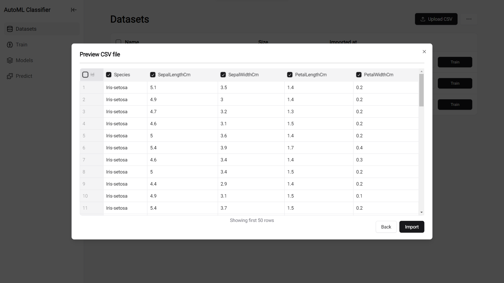
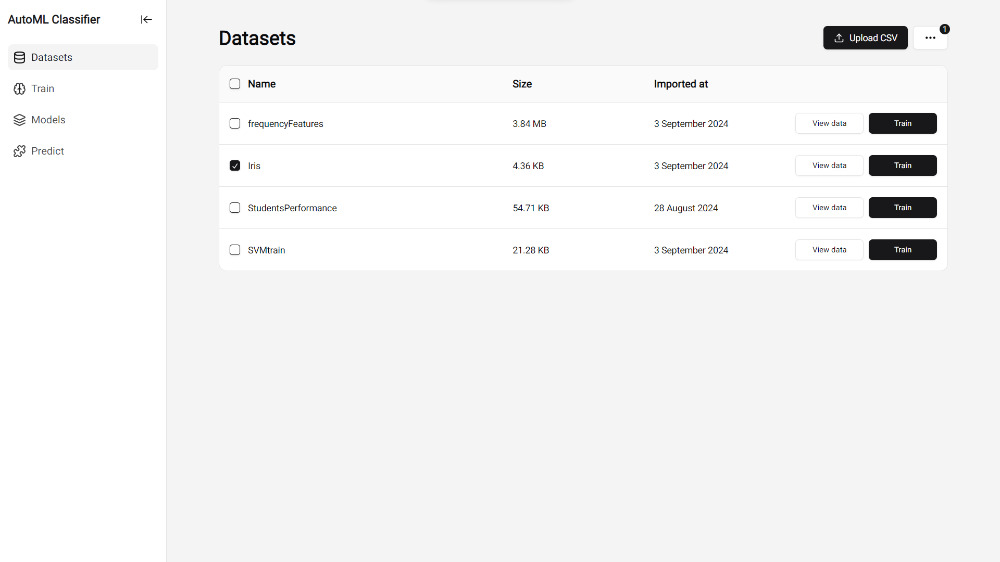
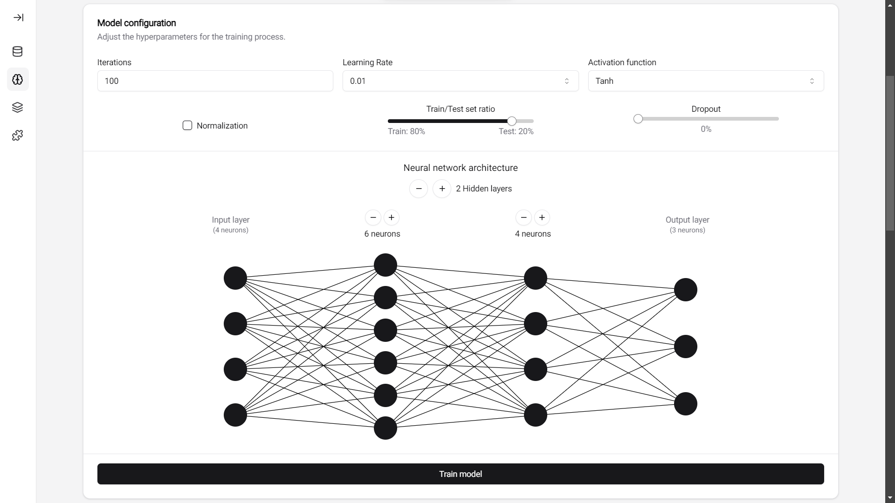
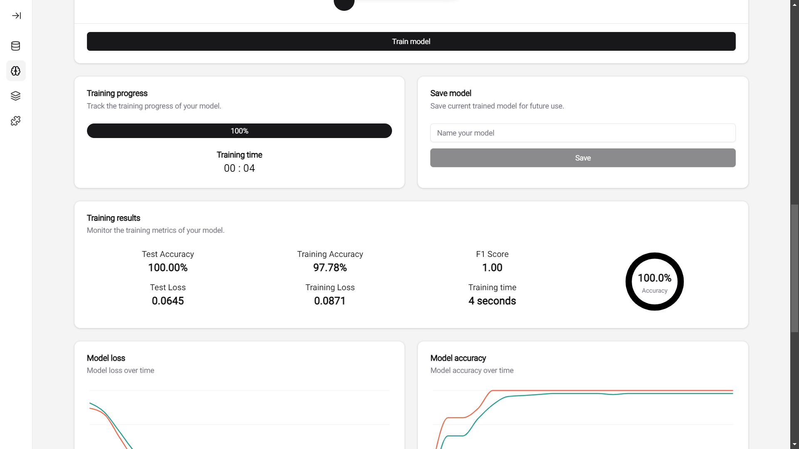
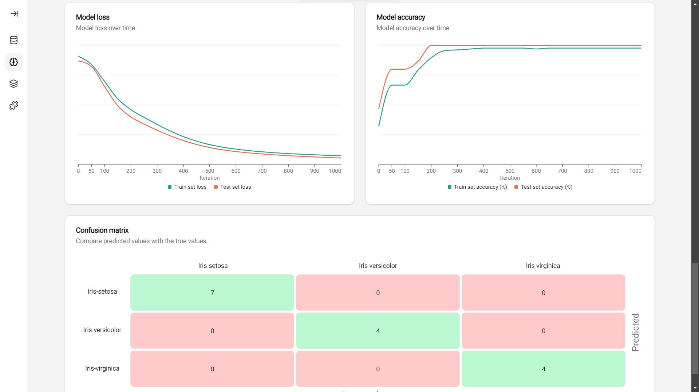
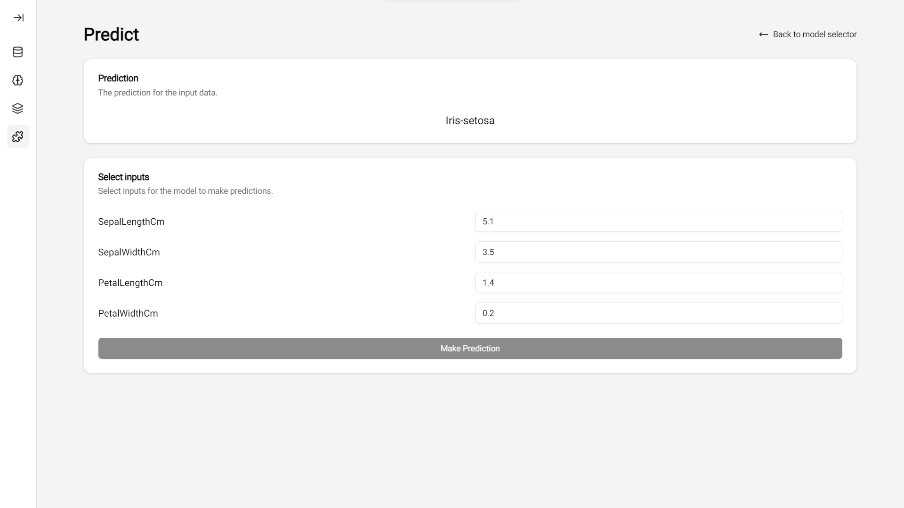

# AutoML Classifier

Flask Backend Repository: https://github.com/99vik/auto-ml-classifier-torch-api

Welcome to the AutoML Classifier! This project integrates a Next.js frontend with a Flask-Python backend to provide an intuitive interface for creating and managing machine learning classification models. With this application, users can effortlessly upload CSV datasets, select hyperparameters, and train classification models. The app also enables users to save trained models and make predictions using custom input data. AutoML Classifier simplifies the process of building and predicting with classification machine learning models. The application is supposed to be run locally.

Welcome to the AutoML Classifier! This project combines a Next.js frontend with a Flask-Python backend to create an intuitive platform for building and managing machine learning classification models. With this application, users can upload CSV datasets, select hyperparameters, and train classification models. The app also allows users to save trained models and make predictions with custom input data. AutoML Classifier simplifies the process of creating and predicting with classification models, it is designed to be run locally.

## Images

